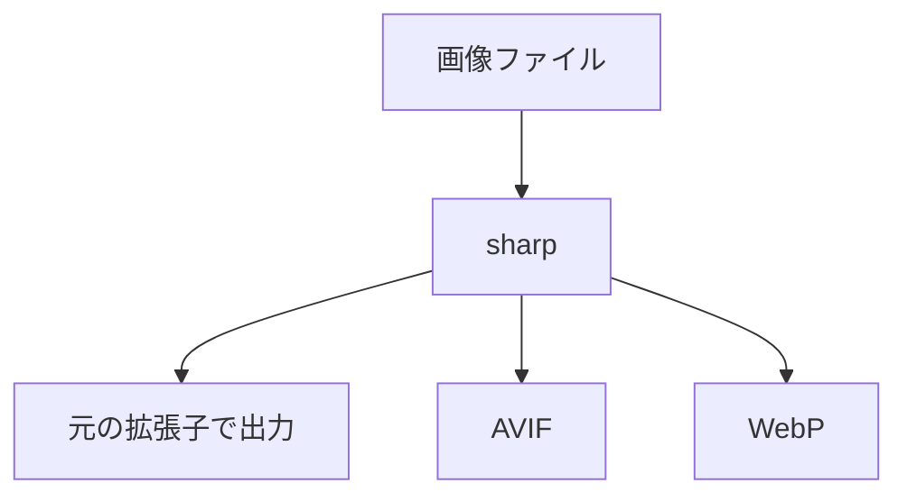

# image-conversion-multi-browser

マルチブラウザ対応用、画像圧縮&amp;拡張子変換

[sharp](https://sharp.pixelplumbing.com/) で画像ファイルの圧縮と拡張子変換を行い、出力する。



## 環境構築

```bash
git clone　https://github.com/naoki-00-ito/image-conversion-multi-browser.git
```

```bash
cd image-conversion-multi-browser
```

```bash
npm install
```

## 使い方

1. プロジェクトルートに `.env.example` をコピーして `.env` ファイルを作成する。

   ```bash
   cp .env.example .env
   ```

    各値は任意のものに設定する。
   - `INPUT_DIR` : 入力画像ファイルを格納するディレクトリ名
   - `OUTPUT_DIR` : 出力画像ファイルを格納するディレクトリ名
   - `QUALITY` : 画像圧縮品質 (1-100)
2. `INPUT_DIR` に画像ファイルを配置する。
3. 以下のコマンドを実行する。

   ```bash
   npm start
   ```

4. `OUTPUT_DIR` に圧縮・変換された画像ファイルが出力される。
