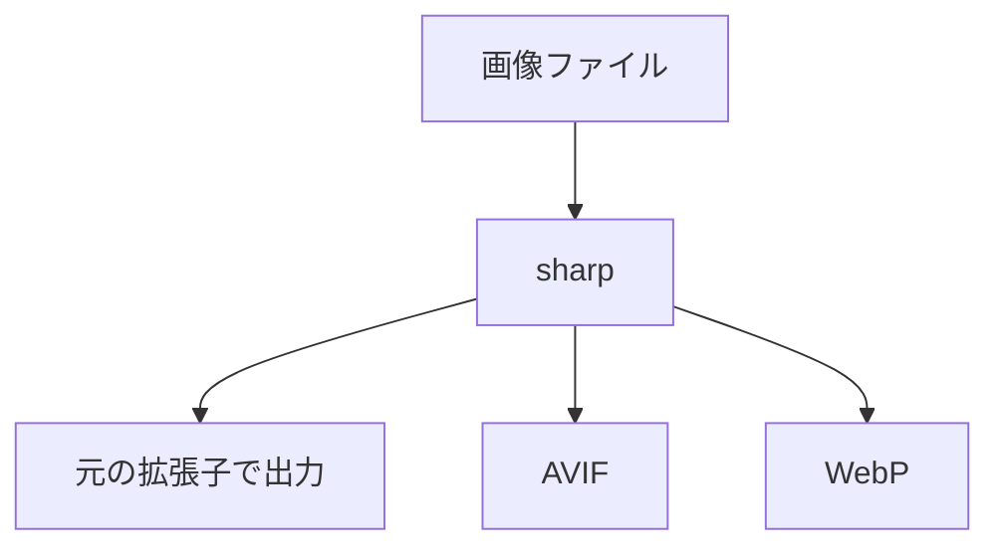

# image-conversion-multi-browser

マルチブラウザ対応用、画像圧縮&amp;拡張子変換

[sharp](https://sharp.pixelplumbing.com/) で画像ファイルの圧縮と拡張子変換を行い、出力する。



## 環境構築

```bash
git clone　https://github.com/naoki-00-ito/image-conversion-multi-browser.git
```

```bash
cd image-conversion-multi-browser
```

```bash
npm install
```

## 構成

```bash
.
├── ${INPUT_DIR}/    # 入力画像格納ディレクトリ
      └── image.jpg
├── ${OUTPUT_DIR}/   # 出力画像格納ディレクトリ
      └── image/
          ├── index.avif       # 変換後画像ファイル (AVIF形式)
          ├── index.webp       # 変換後画像ファイル (WebP形式)
          ├── index.jpg        # 圧縮後画像ファイル (元の拡張子形式)
          ├── index-sp.avif    # スマホ用変換後画像ファイル (AVIF形式)
          ├── index-sp.webp    # スマホ用変換後画像ファイル (WebP形式)
          └── index-sp.jpg     # スマホ用圧縮後画像ファイル (元の拡張子形式)
├── .env.example     # 環境変数設定ファイルのサンプル
├── index.js         # 画像圧縮&変換スクリプト
└── index.test.js    # 画像圧縮&変換スクリプトのテストファイル
```

- `${INPUT_DIR}` : 入力画像ファイルを格納するディレクトリ名 (環境変数で設定)
- `${OUTPUT_DIR}` : 出力画像ファイルを格納するディレクトリ名 (環境変数で設定)

## 使い方

1. プロジェクトルートに `.env.example` をコピーして `.env` ファイルを作成する。

   ```bash
   cp .env.example .env
   ```

    各値は任意のものに設定する。
   - `INPUT_DIR` : 入力画像ファイルを格納するディレクトリ名
   - `OUTPUT_DIR` : 出力画像ファイルを格納するディレクトリ名
   - `QUALITY` : 画像圧縮品質 (1-100)
   - `SP_IMAGE_WIDTH` : スマホ用画像の幅 (ピクセル単位、オプション)
     - 設定すると、通常の画像に加えて、指定した幅にリサイズされたスマホ用画像（`index-sp.avif`、`index-sp.webp`、`index-sp.{元の拡張子}`）が生成されます
     - 設定しない場合は、スマホ用画像は生成されません
2. `INPUT_DIR` ``OUTPUT_DIR` ディレクトリを作成する。

   ```bash
   npm run mkdir
   ```

3. `INPUT_DIR` に画像ファイルを配置する。
4. 以下のコマンドを実行する。

   ```bash
   npm start
   ```

5. `OUTPUT_DIR` に圧縮・変換された画像ファイルが出力される。
