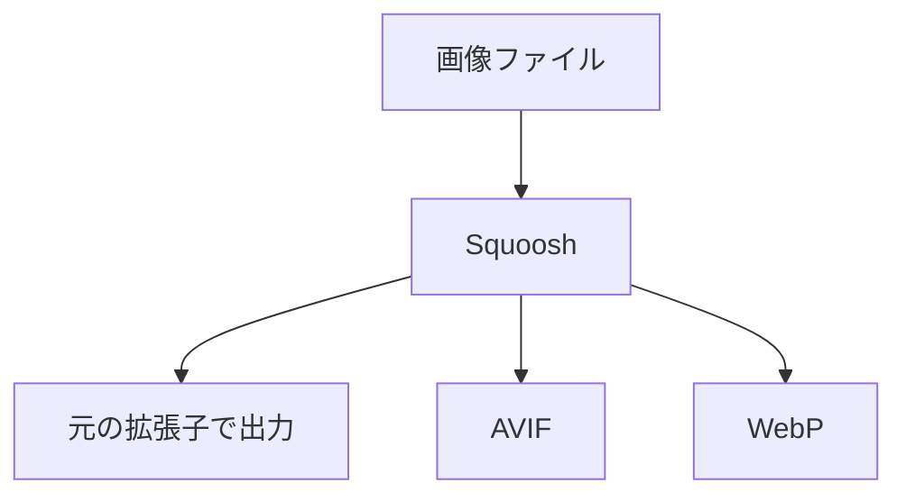

# image-conversion-multi-browser
マルチブラウザ対応用、画像圧縮&amp;拡張子変換

Squoosh で画像ファイルの圧縮と拡張子変換を行い、出力する。

```mermaid
graph TD;
    画像ファイル-->Squoosh;
    Squoosh-->元の拡張子で出力;
    Squoosh-->AVIF;
    Squoosh-->WebP;
```
